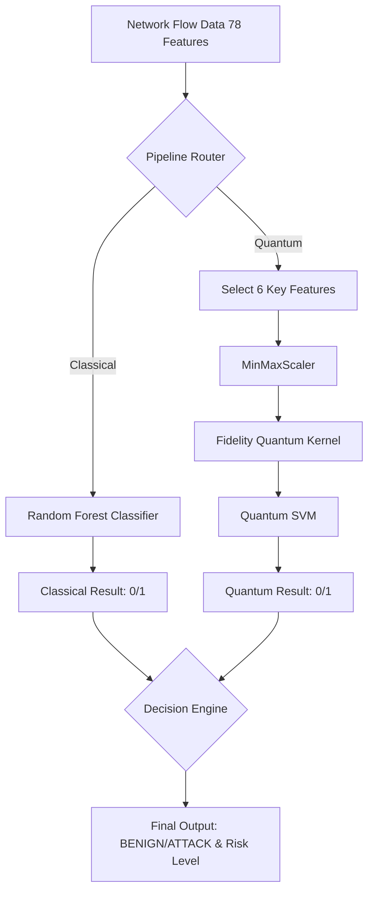

# UC029 Quantum Intrusion Detection

## Problem Statement
Traditional Intrusion Detection Systems (IDS) rely solely on classical machine learning, which can sometimes struggle to capture complex high-dimensional correlations in network flow data. This project implements a **Hybrid Quantum-Classical Machine Learning** IDS using the CIC-IDS-2017 dataset.

## Architecture



## Approach
1. **Classical Random Forest**: A highly optimized model trained on all 78 network-flow features.
2. **Quantum ML Approach**: We select 6 critical features and map them into a quantum state space.
3. **Six Selected Quantum Features**:
   - `Init_Win_bytes_forward`
   - `Fwd Packet Length Max`
   - `Bwd Packet Length Max`
   - `Avg Fwd Segment Size`
   - `Avg Bwd Segment Size`
   - `Total Length of Fwd Packets`
4. **MinMaxScaler**: Scales features appropriately for quantum encoding.
5. **FidelityQuantumKernel**: Computes similarity using Qiskit.
6. **Quantum SVM**: A precomputed SVC that utilizes the quantum kernel matrix.
7. **Hybrid Architecture**: Evaluates both models simultaneously.
8. **UC-029 Test**: A specific record (`data/UC029_test_row.json`) that is verified across both pipelines.
9. **React Frontend**: A premium, visually stunning UI built with Vite for easy dataset uploads and analysis.
10. **FastAPI Backend**: Exposes `/predict` and `/predict-file` endpoints.

## Installation & How to Run

### Backend
1. Install requirements:
   ```bash
   pip install -r requirements.txt
   ```
2. Start the FastAPI server:
   ```bash
   cd backend
   python main.py
   ```
   (Runs on http://127.0.0.1:8000)

### Frontend
1. Install Node.js dependencies:
   ```bash
   cd frontend
   npm install
   ```
2. Start Vite dev server:
   ```bash
   npm run dev
   ```

## Model Evaluation
Use `src/evaluation.py` to compare Accuracy, Precision, Recall, F1 Score, and ROC-AUC between Random Forest and Quantum SVM.

## Limitations & Future Work
- **Limitations**: The Quantum SVM is currently evaluated against a small reference set `(100, 6)` due to classical simulation overhead.
- **Future Work**: Implementing live packet-capture (PCAP) to extract CIC-IDS-2017 features on the fly for real-time live monitoring.
